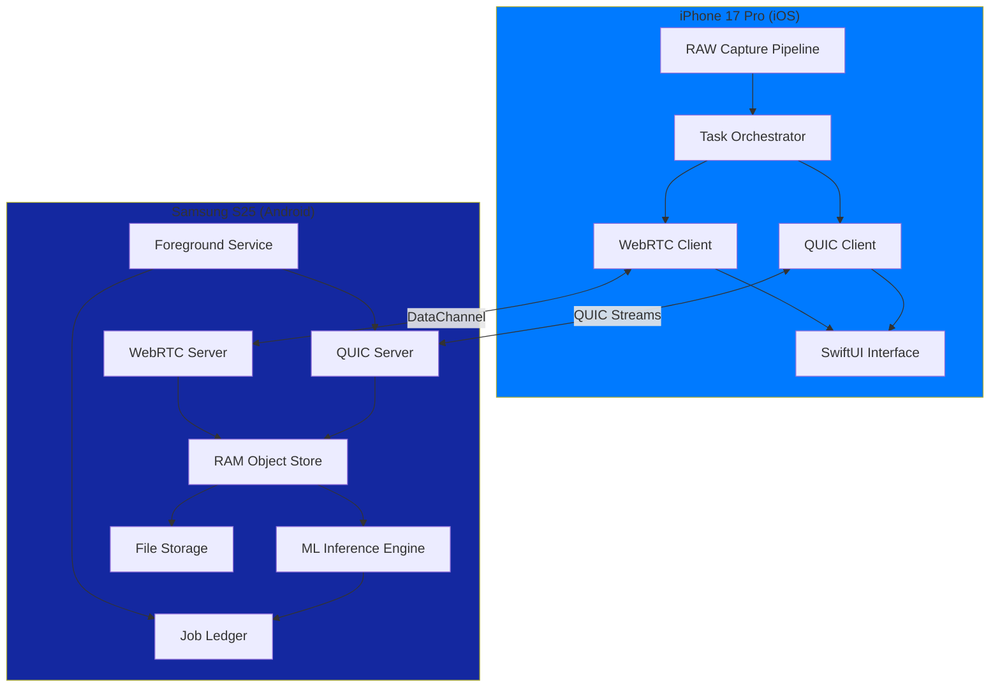
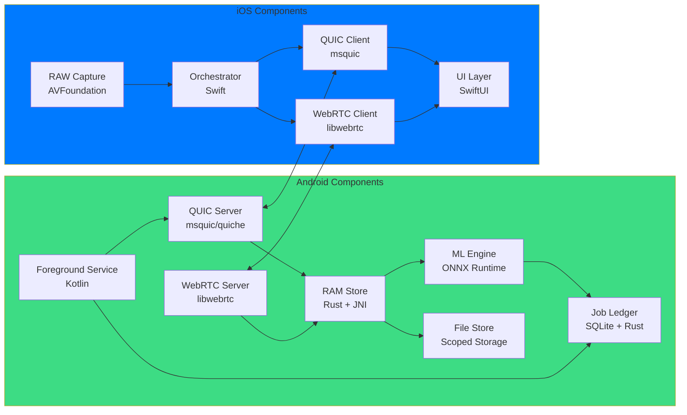
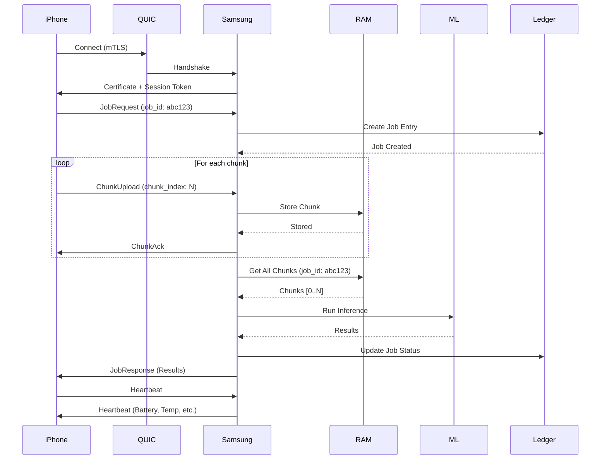
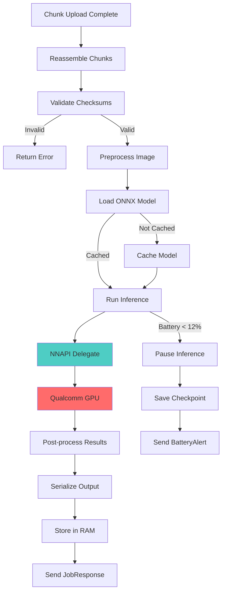
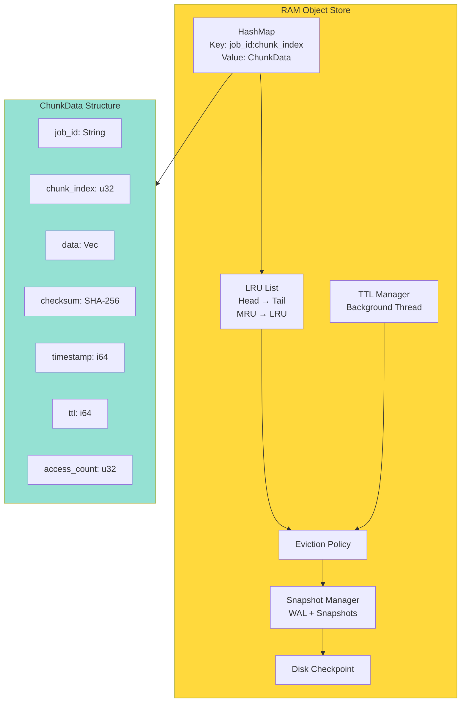
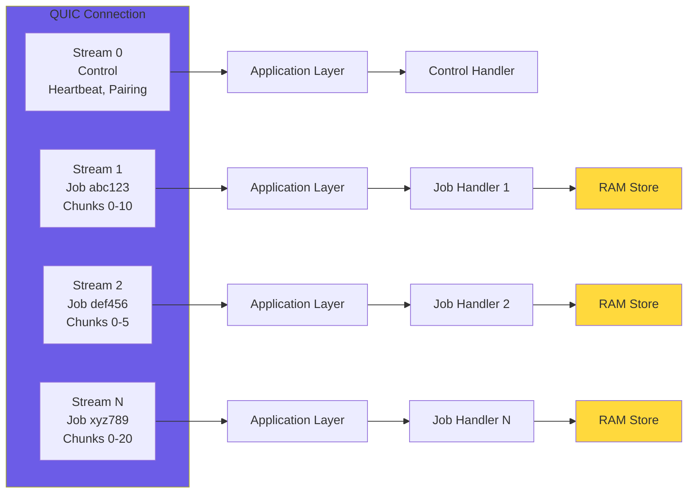
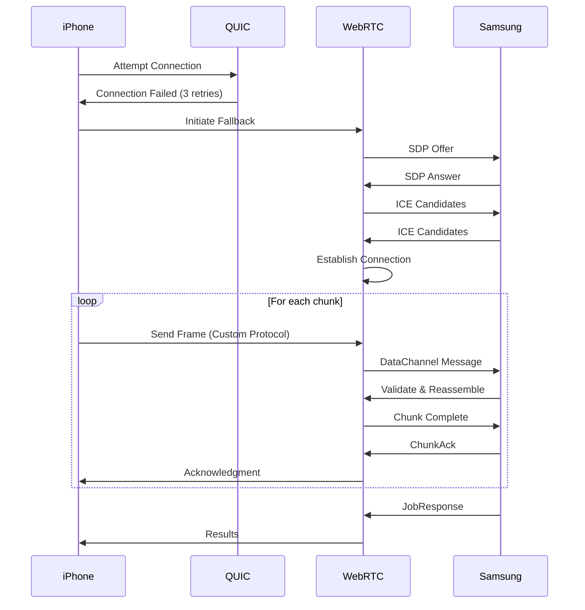
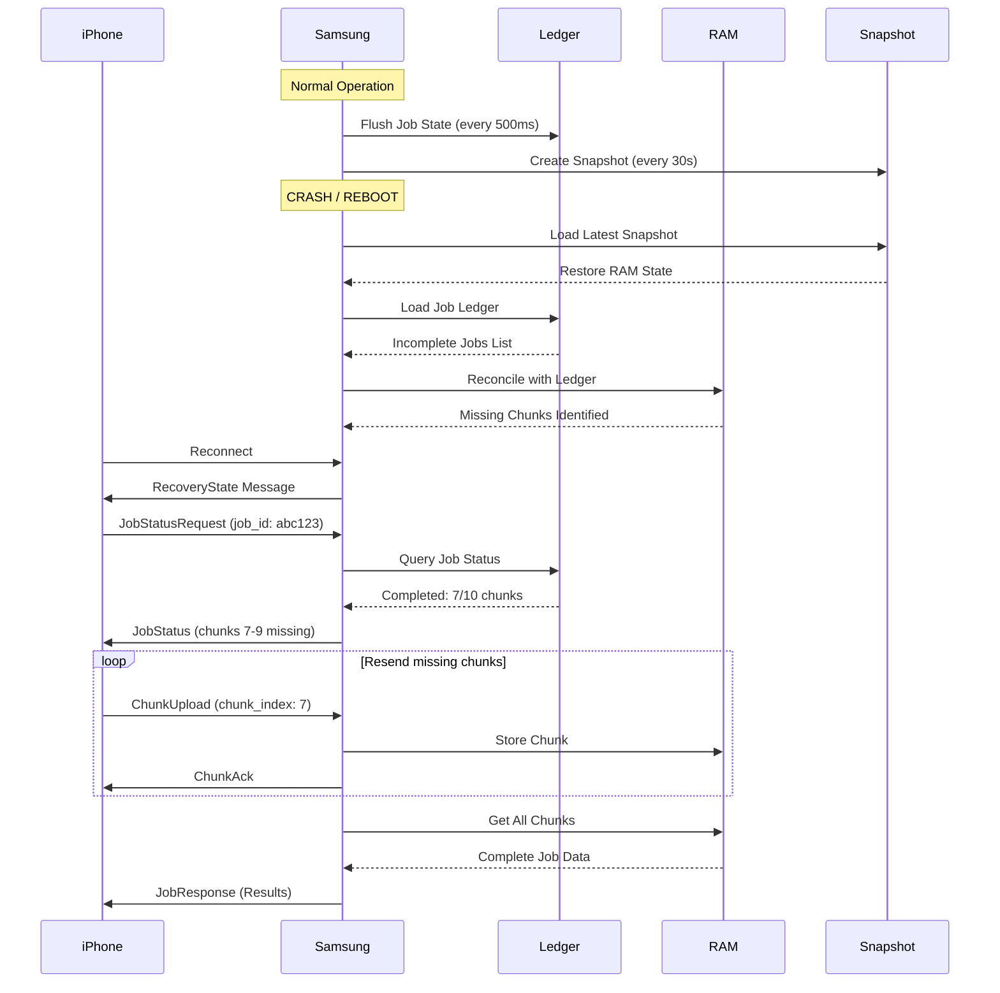
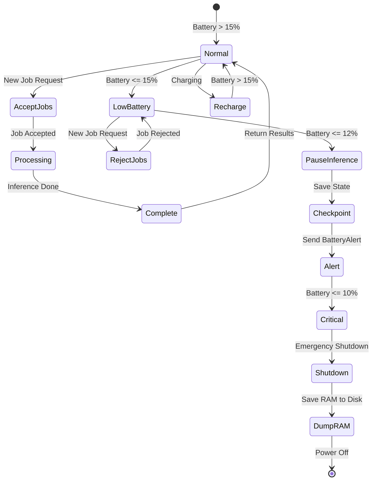

# Project Hydra — Architecture Diagrams

All diagrams are in Mermaid format and can be rendered using Mermaid-compatible tools.

---

## System Architecture Diagram

---

## Component Diagram

---

## Network Flow Diagram

---

## ML Inference Pipeline

---

## RAM Object Store Internal Layout

---

## QUIC Stream Multiplexing

---

## WebRTC Fallback Flow

---

## Crash Recovery Flow

---

## Battery-Aware Scheduling

---

**Document Version:** 1.0  
**Last Updated:** 2024

